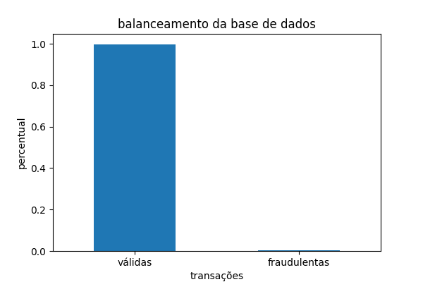
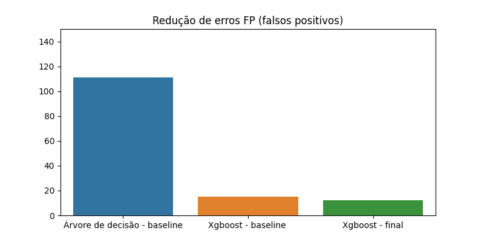
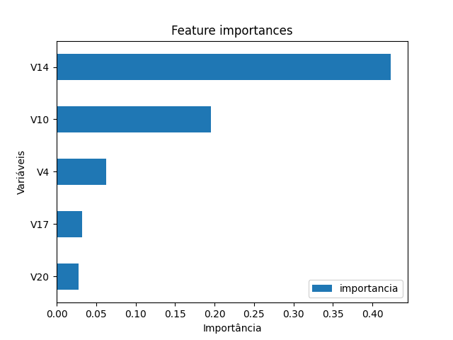
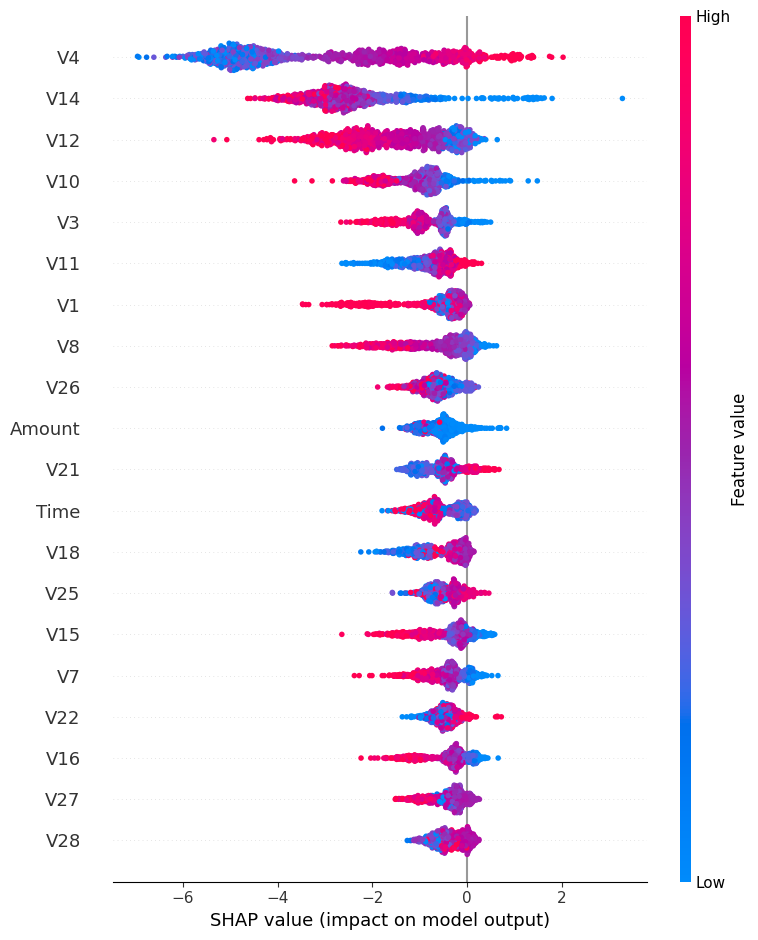

## **Visão geral do projeto**

Projeto de detecção de fraudes em transações financeiras utilizando técnicas de Machine Learning em uma base altamente desbalanceada e anonimizada via PCA.

---

## **🎯 Solução de Negócio**

Fraudes financeiras representam perdas operacionais significativas e exigem modelos capazes de identificar padrões raros sem gerar excesso de falsos positivos.

### **Desafios da Base**



- Base com apenas 0,17% de registros de fraude, fazendo com que métricas tradicionais como acurácia ou ROC-AUC sejam enganosas.
- PCA aplicado na base reduz consideravelmente a interpretabilidade do modelo.

A acurácia foi descartada como métrica principal, pois a base apresenta forte desbalanceamento, tornando necessário o uso de métricas como **PR-AUC, Recall e Precision**.

---

### **Estratégia Analítica**

#### **Pipeline:**

+ Análise inicial dos dados
+ Árvore de decisão como modelo *baseline*
+ XGBoost para comparação de performance
+ Treinamento com validação cruzada (mais robusta)
+ Ajuste leve de hiperparâmetros
+ Análise de limiares (*threshold*)
+ Análise de importância de variáveis e SHAP values para interpretação

---

### **Evolução dos Modelos**

| Modelo                       | PR-AUC | ROC-AUC | Falsos Negativos | Falsos Positivos |
|:-----------------------------|-------:|--------:|----------------:|----------------:|
| Árvore de Decisão (baseline) |  0,54 |   0,91  |              12 |             111 |
| XGBoost (baseline)           |  0,87 |   0,99  |               9 |              15 |
| XGBoost (final)              |  0,84 |   0,97  |              34 |              12 |

O modelo final melhorou a maioria das métricas, com exceção do Recall — que apresentou aumento nos falsos negativos (de 12 para 34). Esse resultado era esperado por dois motivos:

+ **A quantidade de registros fraudulentos mais que dobrou na base de teste; em bases raras, pequenas variações absolutas impactam muito o Recall.**
+ **O modelo trocou uma pequena perda na cobertura de fraudes por um ganho expressivo de precisão: os falsos positivos caíram de 111 para apenas 12 registros.**
+ **O XGBoost ficou mais conservador, acusando fraude apenas quando há alta confiança.**

**📊 Melhorias do modelo final:**

+ **PR-AUC de 0,54 → 0,83**: mesmo buscando casos raros, o modelo mantém alta precisão e erra pouco ao classificar transações.
+ **ROC-AUC de 0,97**: excelente capacidade de separar transações legítimas de fraudulentas.
+ **Falsos Positivos**: queda expressiva dos erros, resultando em **90% de precisão**.



---

### **Interpretação do Modelo**



- Na correlação linear inicial, as variáveis com maior destaque foram **V17 e V14**, ambas com correlação inversa moderada em relação à classe.
- Na análise de importância, as variáveis mais relevantes foram **V14 e V10**.
- Já na análise local com **SHAP Values**, a variável **V4** teve grande influência nas previsões, indicando que, embora não seja a mais usada nas árvores, ela participa fortemente das interações e decisões do modelo.



---

### **Resultado Final**

O modelo apresentou **90% de precisão**, evitando bloqueios indevidos de clientes legítimos, enquanto manteve Recall satisfatório para identificação de fraudes reais.

---

### **Limitações**

+ PCA reduz a interpretabilidade direta das variáveis originais
+ O limiar de decisão depende da estratégia do negócio (custo de erro vs. cobertura)
+ Possível *data drift* em produção por ser base anonimizada

---

### **Próximos Passos**

+ Calibração de probabilidades
+ Monitoramento contínuo de performance
+ Testes com *ensemble* de modelos
+ Uso de dados temporais, se disponíveis

---

## 🛠️ Como rodar o projeto

1. Instale as dependências:
   ```bash
   pip install -r requirements.txt
